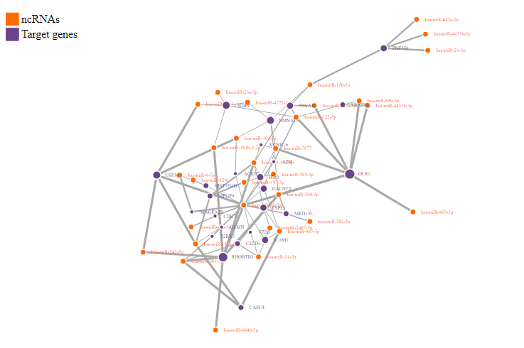

<!-- README.md is generated from README.Rmd. Please edit that file -->

```{r, include = FALSE}
knitr::opts_chunk$set(
  collapse = TRUE,
  comment = "#>",
  fig.path = "man/figures/README-",
  out.width = "100%"
)
```

# Introduction

<!-- badges: start -->
<!-- badges: end -->

CORALIS is an R package for analyzing interactions between non-coding
RNA (ncRNA) and their target genes (mRNA). To this end CORALIS gathers
experimentally validated records (ncRNA - mRNA interactions) from
[miRTarbase](http://mirtarbase.cuhk.edu.cn/php/index.php) and [RNAInter v4 database](http://www.rna-society.org/rnainter/) that will be used as
as background during the analysis. CORALIS employs a hypergeometric
distribution test to determine enriched target genes given a list of
non-coding RNAs in [miRBase](http://www.mirbase.org/search.shtml) format
for microRNA-target enrichment analysis (ie: ‘hsa-miR-3196’) or
[Official Gene Symbol](https://www.genenames.org/) format for the rest
of ncRNAs (i.e: ‘RUNX2’). So far, CORALIS supports miRNA, lncRNA, snRNA and snoRNA target enrichment analysis for several species such as *Homo sapiens*, *Rattus norvegicus*, *Caenorhabditis elegans* and *Drosophila melanogaster*, among others. 

## Installation
You can install both the release and the development version of CORALIS
from [GitHub](https://github.com/Daniel-VM/CORALIS) with:

``` {r eval=FALSE}
# install.packages("devtools")
devtools::install_github(repo = "Daniel-VM/CORALIS",
                         ref = "dev",
                         dependencies = T, 
                         build_vignettes = T
                         )
```

Make sure you have installed *R* (>= 4.2) and the R package *devtools* (>= 2.4.4) before installing CORALIS.

## USAGE
### Target Enrichment Analysis
The CORALIS's *tienrich()* function performs enrichment analysis for ncRNA-target interactions. A basic usage example for human microRNA target analysis is shown below: 


```{r example}
# LOAD PACKAGES
library(CORALIS)

# LOAD TEST DATASET
data(rnasID)

# SET OF HUMAN microRNA IDs
head(ids[["miRNAs"]])

# RUN microRNA TARGET ENRICHMENT ANALYSIS WITH tienrich()
tar_mir <- tienrich(input_list=ids[['miRNAs']], min = 2, fdr = 1, organism='Homo sapiens', type = 'miRNA_mRNA')

# OUTPUT 1 (microRNA-target analysis output)
head(tar_mir@results)

# OUTPUT 2 (microRNA in the input with no target records)
head(tar_mir@not_found)
```

### Visualization

The function *nodevisu()* display a series of graphs to visualize the target interaction analysis results. Two formats are supported: 


**Barplot:**

``` {r}
nodeVisu(obj = tar_mir,
         top=25,
         type = "barplot")
```

**Interactive network plot:**

```{r eval=FALSE}
nodeVisu(obj = tar_mir, 
         top = 25, 
         fixedsize = FALSE, # if true, default node size is fixed
         type = "network")
```



## Case-stude example

Case-study example and further information about CORALIS is available CORAILS vignettes (preferred web browsers: Google Chrome and Mozilla Firefox). 

```{r eval=FALSE}
browseVignettes("CORALIS")
```

