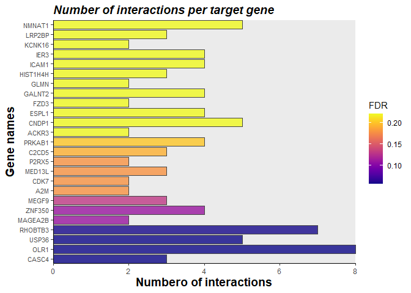
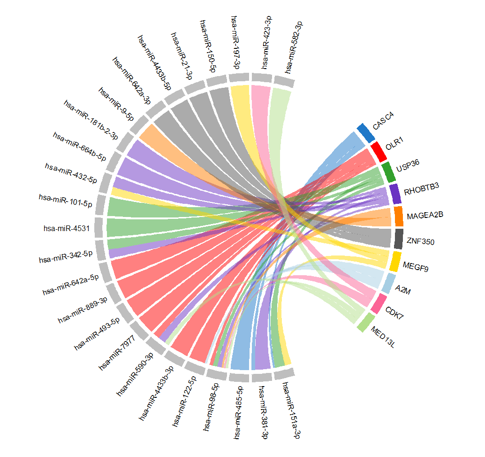
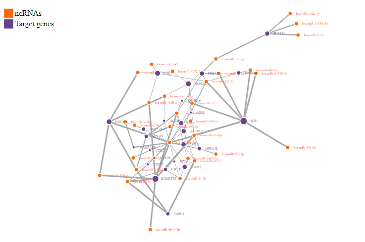

<!-- README.md is generated from README.Rmd. Please edit that file -->

# Introduction

<!-- badges: start -->
<!-- badges: end -->

CORALIS is an R package for analyzing interactions between non-coding
RNA (ncRNA) and their target genes (mRNA). To this end CORALIS gathers
experimentally validated records (ncRNA - mRNA interactions) from
[miRTarbase](http://mirtarbase.cuhk.edu.cn/php/index.php) and [RNAInter v4 database](http://www.rna-society.org/rnainter/) that will be used as
as background during the analysis. CORALIS employs a hypergeometric
distribution test to determine enriched target genes given a list of
non-coding RNAs in [miRBase](http://www.mirbase.org/search.shtml) format
for microRNA-target enrichment analysis (ie: ‘hsa-miR-3196’) or
[Official Gene Symbol](https://www.genenames.org/) format for the rest
of ncRNAs (i.e: ‘RUNX2’). So far, CORALIS supports miRNA, lncRNA, snRNA and snoRNA target enrichment analysis for several species such as *Homo sapiens*, *Rattus norvegicus*, *Caenorhabditis elegans* and *Drosophila melanogaster*, among others. 

## Installation
You can install both the release and the development version of CORALIS
from [GitHub](https://github.com/Daniel-VM/CORALIS) with:

``` r
# install.packages("devtools")
devtools::install_github(repo = "Daniel-VM/CORALIS",
                         ref = "dev",
                         dependencies = T, 
                         build_vignettes = T
                         )
```
Make sure you have installed *R* (>= 4.2) and the R package *devtools* (>= 2.4.4) before installing CORALIS.


## USAGE
### Target Enrichment Analysis
The CORALIS's *tienrich()* function performs enrichment analysis for ncRNA-target interactions. A basic usage example for human microRNA target analysis is shown below: 

``` r
# LOAD PACKAGES
library(CORALIS)

# LOAD TEST DATASET
data(rnasID)

# SET OF HUMAN microRNA IDs
head(ids[["miRNAs"]])
#> [1] "hsa-miR-1291"     "hsa-miR-642a-3p"  "hsa-miR-485-5p"   "hsa-miR-98-5p"   
#> [5] "hsa-miR-4433b-3p" "hsa-miR-3605-3p"

# RUN microRNA TARGET ENRICHMENT ANALYSIS WITH tienrich()
# ?tienrich() # Access to help page
tar_mir <- tienrich(input_list=ids[['miRNAs']], min = 2, fdr = 1, organism='Homo sapiens', type = 'miRNA_mRNA')
#> No targets found for:
#> hsa-miR-10399-3p
#> hsa-miR-11400
#> 
#> Analyzing  target genes with >=2 hits for'miRNA'in the input.
#> 
#> Analysis complete

# OUTPUT 1 (microRNA-target analysis output)
head(tar_mir@results)
#>   Gene_symbol num_interactions
#> 1       CASC4                3
#> 2        OLR1                8
#> 3       USP36                5
#> 4     RHOBTB3                7
#> 5     MAGEA2B                2
#> 6      ZNF350                4
#>                                                                                                                                  ncRNAs
#> 1                                                                                     hsa-miR-151a-3p / hsa-miR-381-3p / hsa-miR-485-5p
#> 2 hsa-miR-98-5p / hsa-miR-122-5p / hsa-miR-4433b-3p / hsa-miR-590-3p / hsa-miR-7977 / hsa-miR-493-5p / hsa-miR-889-3p / hsa-miR-642a-5p
#> 3                                                      hsa-miR-98-5p / hsa-miR-342-5p / hsa-miR-151a-3p / hsa-miR-4531 / hsa-miR-101-5p
#> 4               hsa-miR-98-5p / hsa-miR-432-5p / hsa-miR-664b-5p / hsa-miR-381-3p / hsa-miR-181b-2-3p / hsa-miR-590-3p / hsa-miR-342-5p
#> 5                                                                                                          hsa-miR-9-5p / hsa-miR-98-5p
#> 6                                                                   hsa-miR-642a-3p / hsa-miR-4433b-5p / hsa-miR-21-3p / hsa-miR-150-5p
#>         pvalue        FDR        OR     OR.SE OR.IC.lower OR.IC.upper
#> 1 5.765227e-05 0.05697310 84.966667 0.9251745   13.859214   520.90503
#> 2 8.614884e-05 0.05697310  6.789041 0.4050953    3.068956    15.01849
#> 3 5.677196e-05 0.05697310 15.495716 0.5256257    5.530931    43.41352
#> 4 1.181216e-04 0.05858829  7.606707 0.4307033    3.270253    17.69343
#> 5 3.341132e-04 0.11048011       Inf       Inf         NaN         Inf
#> 6 3.240906e-04 0.11048011 15.369697 0.5829136    4.903299    48.17728

# OUTPUT 2 (microRNA in the input with no target records found)
head(tar_mir@not_found)
#> [1] "hsa-miR-10399-3p" "hsa-miR-11400"
```

### Visualization

The function *nodevisu()* display a series of graphs to visualize the target interaction analysis results. Two formats are supported: 

**Barplot:**
``` r
nodeVisu(obj = tar_mir,
         top=25,
         type = "barplot")
```



**Chord plot:**
``` r
nodeVisu(obj = tar_mir, 
         top = 25, 
         type = "chord")
```


**Interactive network plot:**
``` r
nodeVisu(obj = tar_mir, 
         top = 25, 
         fixedsize = FALSE, # if true, default node size is fixed
         type = "network")
```



## Case-stude example

Case-study example and further information about CORALIS is available in CORAILS vignettes (preferred web browsers: Google Chrome and Mozilla Firefox). 

``` r
browseVignettes("CORALIS")
```